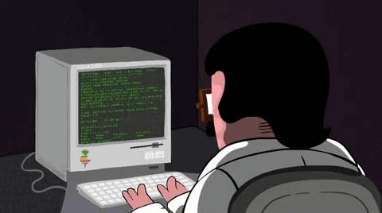

# Hey there, I'm Youssef Rifai 👋

  

## About Me:

I am a Full Stack Developer 🧑‍💻 from Morocco 🇲🇦.

- 🔭 I’m currently working on [Moutabari3](https://github.com/ucefdev1/moutabari3), a platform for blood donations and medical consultations.
- 🌱 I’m currently learning **Tailwind CSS** and **React.js**.
- 🧠 Always interested in improving my skills in **Laravel**, **PHP**, **JavaScript**, and more.
- 👯 I’m looking to collaborate on **open source projects** that make a positive impact.
- 💬 Ask me about **Laravel**, **React.js**, **Laravel**, or **Tailwind CSS**.
- 📫 How to reach me: [Gmail](mailto:ucefstuff@gmail.com) or [LinkedIn](https://linkedin.com/in/ucefdev).
  
## Languages and Tools:

  

## My Stats:

 

## Projects:

- **[Moutabari3](https://github.com/ucefdev1/moutabari3):** An online blood donation and medical consultation platform.
- **[Artikel Finder](https://github.com/ucefdev1/Artikel-finder):** A German article finder & article game built with React.js.
- **[Portfolio](https://ucefdev.vercel.app):** My personal portfolio site showcasing my work and projects.

## How to reach me:

Feel free to check out my repositories and contribute if you'd like!
